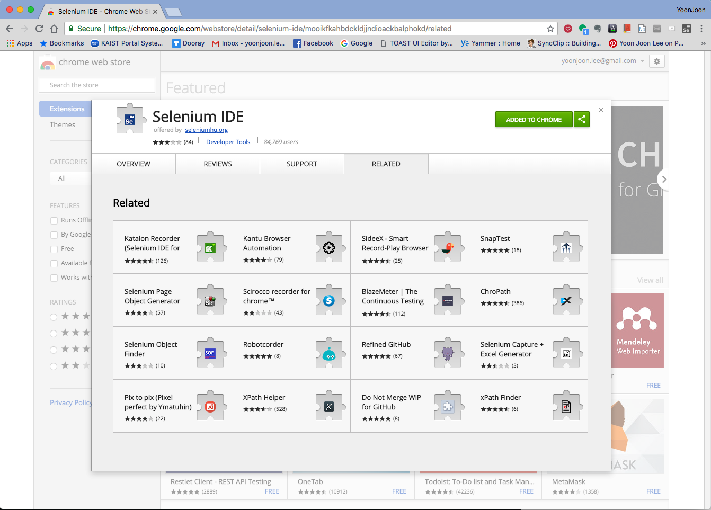
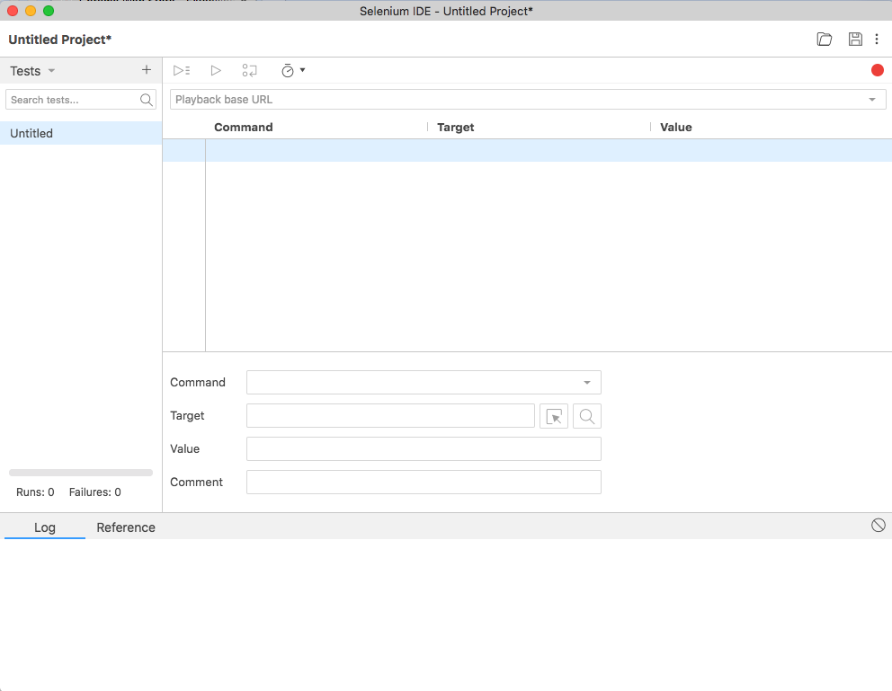
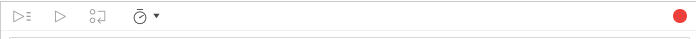
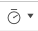
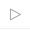
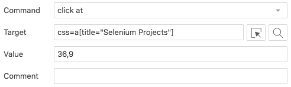
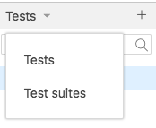
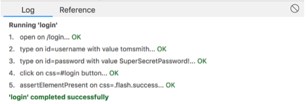
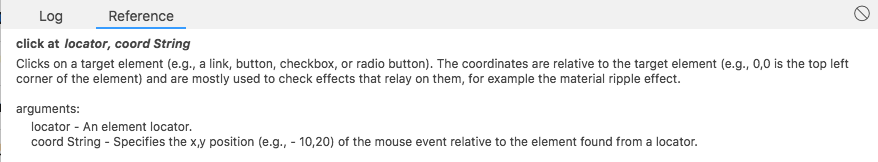
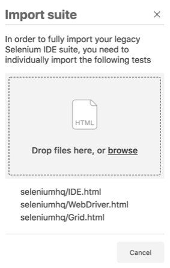

Selenium IDE
------------

### 개요

Selenium-IDE(통합 개발 환경)는 Selenium 테스트 케이스를 개발하는 데 사용하는 도구입니다. 간편하도록 Chrome 및 Firefox 확장(extension)을 이용하여 시용하며 일반적으로 테스트 케이스를 개발하는 가장 효율적인 방법입니다. Selenium 명령을 사용하여 브라우저에서 사용자 행동과 그 컨텍스트에서 정의된 매개 변수를 함꼐 기록합니다. 이는 시간을 절약 할뿐만 아니라 Selenium 스크립트 구문을 배우는 좋은 방법입니다.

이 장은 Selenium IDE와 이를 효과적으로 사용하는 방법에 관한 내용입니다.

### IDE 설치하기

Chrome 또는 Firefox를 사용하여 IDE 다운로드 하십시요.

Chrome에 또는 Firefox에 추가를 클릭합니다. 설치가 끝나면 주소 표시 줄의 오른쪽에 버튼이 나타납니다.

### IDE 열기

Selenium IDE를 실행하려면 검색 주소창 오른쪽에 있는 버튼을 클릭하면, 빈 스크립트 편집과 프로젝트를 열거나 저장하는 버튼이 있는 창(window)이 아래와 같이 열립니다.

### IDE 기능

#### 툴바 (Toolbar)

도구 모음에는 테스트 케이스 디버깅을 위한 단계 기능을 포함하여 테스트 사례의 실행을 제어하기 위한 버튼이 있습니다. 가장 오른쪽에 있는 빨간색 점은 녹음 버튼입니다.

 속도조절 : 테스트 케이스 실행 속도를 조절합니다.

 모두 실행 : 여러 테스트 케이스가 있는 테스트 스위트를 로드한 다음 전체 테스트 스위트를 실행합니다.

 실행 : 현재 선택된 테스트를 실행합니다. 단일 테스트만 있다면, 이 버튼과 모두 실행 버튼은 동일한 효과를 냅니다.

 일시 중지 / 다시 시작 : 실행중인 테스트 케이스를 일시 중지시키거나 다시 시작할 수 있습니다.

 중지 : 현재 실행중인 테스트 케이스를 중지합니다.

 단계별 수행 : 한 번에 하나의 명령을 실행하여 테스트 케이스를 "수행"할 수 있습니다. 테스트 케이스 디버깅에 사용합니다.

 녹화 : 테스트 케이스에서 사용자의 브라우저 동작을 기록합니다.

#### 테스트 케이스 판넬

테스트 케이스 패널에는 작성한 스크립트를 보여줍니다.

-	| Command | Target | Value --|-----|-----|---
-	| *open* | / |
-	| click at | css=a[title="Selenium Projects"] | 36,9
-	| click at | xpath=[//a[contents(text(),'Selenium IDE')]][2] |50,4

Command, Target 및 Value 입력 필드에는 현재 선택된 명령을 매개 변수와 함께 표시합니다. 현재 선택된 명령을 수정할 수 있는 입력 필드입니다. 맨 밑 pane의 Reference 탭에 있는 명령 수행을 위한 첫 번째 매개 변수가 항상 Target 필드에 들어갑니다. Reference 탭에서 두 번째 매개 변수를 지정하면 항상 Value 필드로 이동합니다. Comment 필드에서는 사람이 읽을 수 있는 형식으로 현재 명령에 대한 설명을 기술할 수 있습니다.

Command 필드에 입력을 시작하면 입력 한 첫 번째 문자를 기준으로 드롭 다운 목록이 채워집니다. 드롭 다운에서 원하는 명령을 선택할 수 있습니다.

#### 탐색 판넬

Selenium IDE의 오른쪽에서 테스트 케이스와 테스트 스위트 간 탐색을 수행합니다. 작은 "Tests"의 작은 캐럿을 클릭하면 메뉴가 열립니다.

프로젝트를 저장하면 모든 테스트 케이스와 스위트를 결합하여 새로운 **.side** 형식의 파일로 저장하며 프로젝트로 언급합니다.

#### 콘솔 판넬

Web devtools과 비슷하며 Console 판넬이라고 부르는 하단 패인은 콘솔 패널로, Log 또는 Reference탭 선택에 따라 이들 기능을 위하여 사용한다.

##### Log

테스트 케이스를 실행하면 처음에 로그 탭을 선택하지 않은 경우에도 오류 메시지와 진행률을 나타내는 메시지가 이 창에 자동으로 표시됩니다. 이 메시지는 종종 테스트 케이스 디버깅에 유용합니다. Log 지우기 단추를 확인하십시오.

##### Reference

테스트 단계를 추가, 편집 또는 표시할 때 이 창에는 현재 명령에 대한 이름, 설명, 입력된 인수 및 인수에 대한 세부 정보 등을 보여줍니다.

### 레거시 IDE로부터 마이그레이션

#### 래거시 테스트 케이스 및 스위트 로딩

테스트 케이스를 로드하려면 폴더 버튼을 사용하여 테스트 케이스를 열면 자동으로 로드되고, 저장될 때는 새로운 *.side* 형식의 파일로 저장합니다.

테스트 스위트는 폴더 버튼을 사용하여 스위트를 로드 한 후 몇 가지 추가 단계를 거쳐야 하므로 대화 상자를 사용하여 스위트에서 참조 된 테스트 케이스를 업로드해야 합니다.

모든 테스트 케이스를 업로드하면 대화 상자가 자동으로 닫히고 테스트 스위트를 실행할 준비가 됩니다.

#### AndWait and waitFor are gone? (?)

Selenium IDE는 모든 명령에서 자동으로 사용자 입력을 기다리며, 모든 명령은 페이지가로드 될 때까지 기다린다. 로케이터를 사용하는 명령은 요소가 나타날 때까지 기다립니다. 다행히도 명시적으로 기다릴 필요가 없습니다. 아주 드문 경우이지만 충분하지 않다면 일시 중지 명령을 대신 사용할 수 있습니다.

### 테이스 케이스 작성

테스트 케이스는 세 가지 기본 방법으로 개발할 수 있습니다. 테스트 개발자에게 세 가지 기술 모두 필요로 합니다.

#### 녹화 (Recording)

초보 사용자는 웹 사이트와의 상호 작용에서 테스트 케이스를 기록하는 것으로 시작합니다. Selenium-IDE를 처음 열면 이전 버전과 달리 녹화 버튼은 기본적으로 꺼져 있습니다.

녹화하는 동안 Selenium-IDE는 사용자의 작업에 따라 자동으로 명령을 테스트 케이스에 삽입합니다. 일반적으로 다음이 포함됩니다. - 링크 클릭 - *click or click at* 명령 - 값 입력 - *type* 명령 - a drop-down listbox에서 선택 - *select* 명령 - checkboxes 또는 radio 버튼 클릭 - *click* command

알아야 할 팁은 다음과 같습니다. - *type* 명령은 기록할 웹 페이지의 다른 영역을 클릭해야 할 수 있습니다.

#### 컨텍스트 메뉴를 사용하여 검증(Verification) 및 주장(Assert) 추가

테스트 케이스는 웹 페이지의 속성을 점검해야 합니다. 이를 위해서는 *assert*와 *verify* 명령이 필요합니다. 여기에서 이 명령의 세부 사항을 설명하지 않고 [Selenium Commands - "Selenese"]()장에서 다룰 것입니다. 여기서는 테스트 케이스에 추가하는 방법만을 간단히 설명합니다.

Selenium IDE 녹화를 사용하면 테스트 애플리케이션을 표시하는 브라우저로 이동하여 페이지 어느 곳에 마우스 오른쪽 버튼을 클릭하십시오. *Verify* 또는 *Assert* 명령을 보여주는 컨텍스트 메뉴가 나타납니다.
